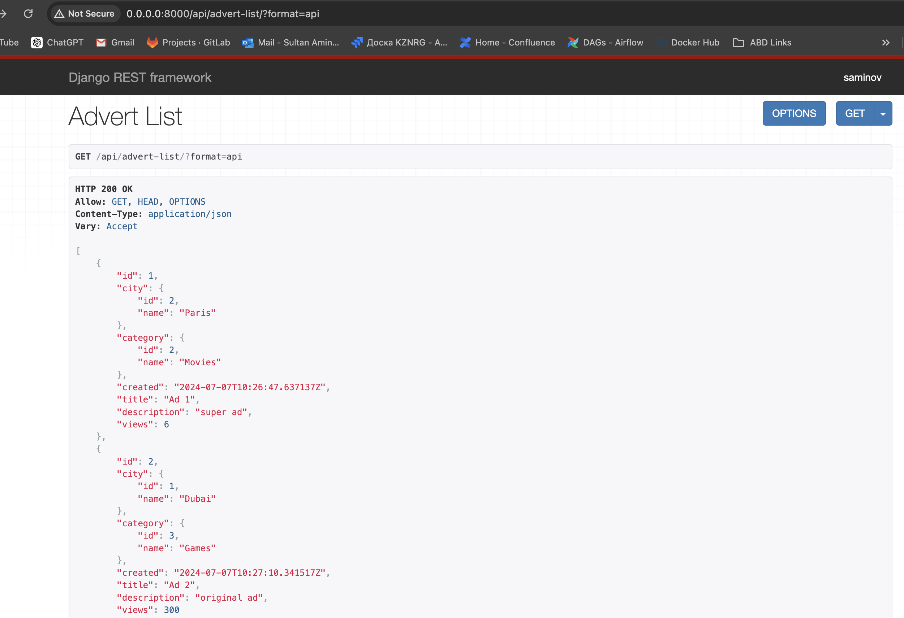
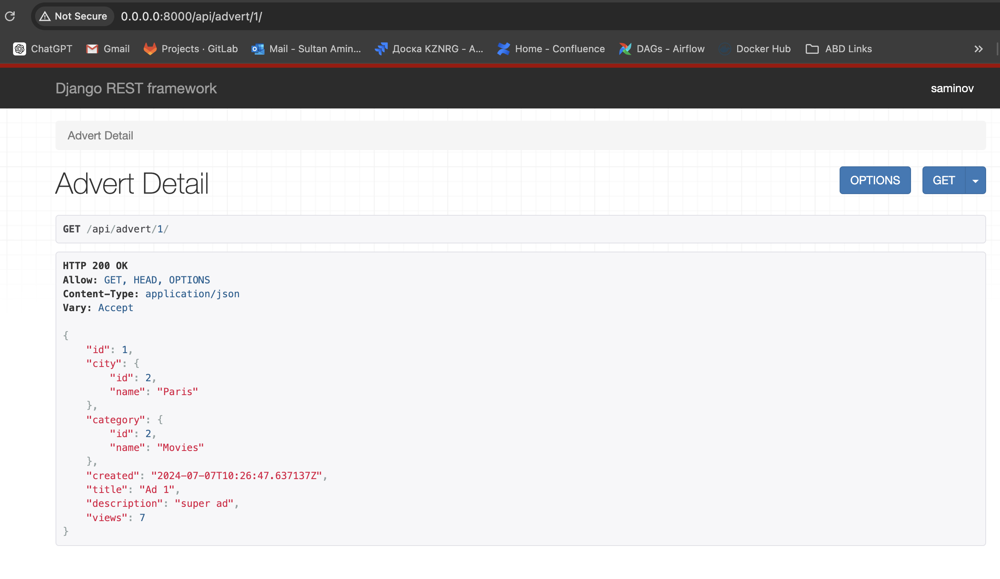

# Проект Django DRF для Объявлений

Этот проект представляет собой небольшое приложение на Django и DRF для управления объявлениями с категориями и городами, оптимизированное для работы с базой данных и работающие в Docker.

## Модели

- **Category**: Категории объявлений, поля: `name`
- **City**: Город объявления, поля: `name`
- **Advert**: Объявление, поля: `created` (дата создания), `title`, `description`, `city`, `category`, `views`

## API Эндпоинты

- **/api/advert-list/**: JSON список объявлений со всеми полями, включая название города и категории.



- **/api/advert/<advert-pk>/**: JSON детальный просмотр одного объявления со всеми полями, увеличивает счетчик просмотров.




## Установка и Настройка

### Требования

- Docker и Docker Compose.

### Шаги Установки

1. Клонируйте репозиторий:

    ```sh
    git clone <адрес-репозитория>
    cd <директория-репозитория>
    ```

2. Сборка и запуск контейнеров Docker:

    ```sh
    docker-compose up --build
    ```

3. Создание и применение миграций:

    ```sh
    docker-compose exec web python manage.py makemigrations
    docker-compose exec web python manage.py migrate
    ```

4. Создание суперпользователя:

    ```sh
    docker-compose exec web python manage.py createsuperuser
    ```

5. Доступ к приложению:
    - Приложение: `http://0.0.0.0:8000`
    - Админ панель: `http://0.0.0.0:8000/admin`

## Оптимизация Производительности

- Используется `select_related` для оптимизации запросов ForeignKey.
- Индексация часто запрашиваемых полей, таких как `created`.
- Эффективное обновление счетчика просмотров с помощью `F()` выражений.